# Bộ sơ đồ Mermaid cho báo cáo

Ghi chú:
- Các sơ đồ được sắp đúng thứ tự chèn ảnh trong báo cáo LaTeX.
- Xuất lần lượt thành `web1.png`, `web2.png`, ... `web21.png`.
- Các sơ đồ dạng luồng/use case/activity dùng `LR` để trải ngang.

## web1 - Use case tổng quan hệ thống
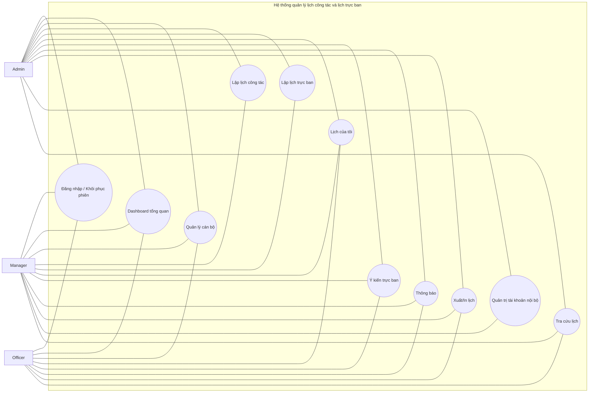

## web2 - Use case phân rã nhóm xác thực
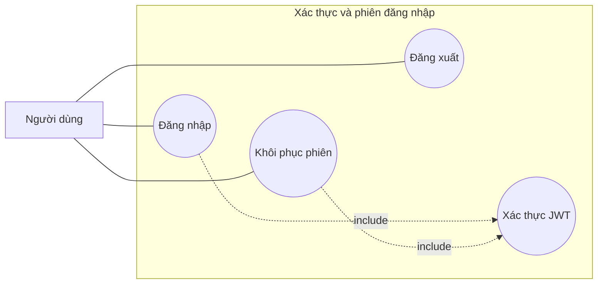

## web3 - Use case phân rã nhóm quản lý cán bộ
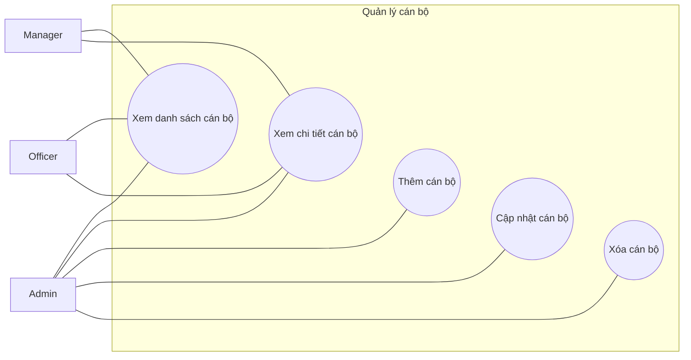

## web4 - Use case phân rã nhóm lịch công tác


## web5 - Use case phân rã nhóm lịch trực ban
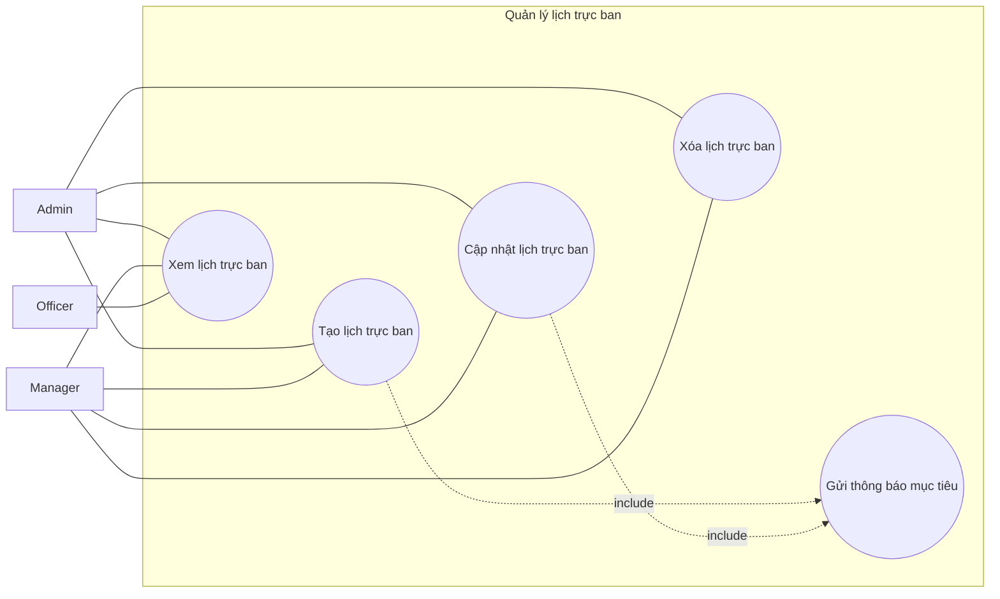

## web6 - Use case phân rã nhóm Lịch của tôi
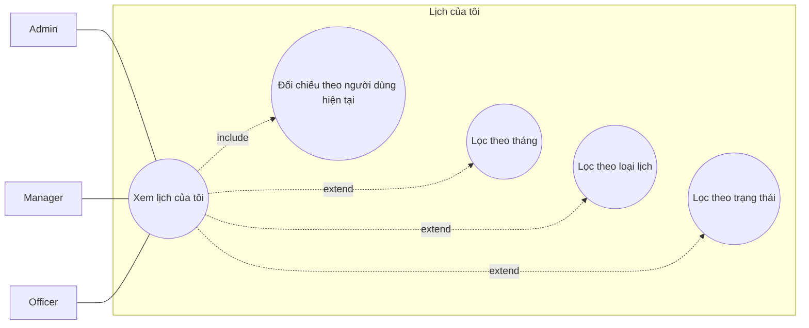

## web7 - Use case phân rã nhóm ý kiến trực ban
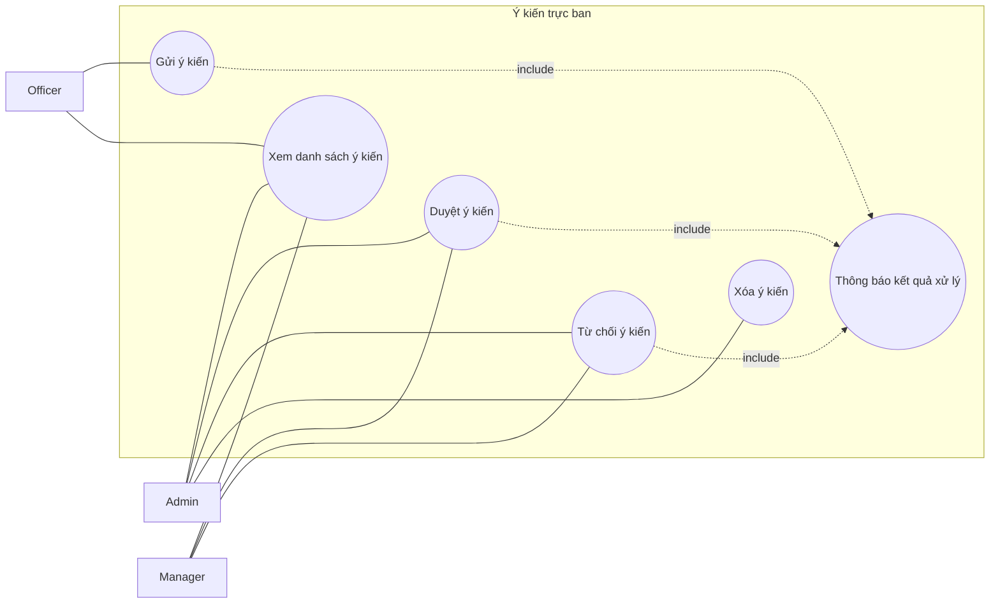

## web8 - Use case phân rã nhóm thông báo và xuất dữ liệu
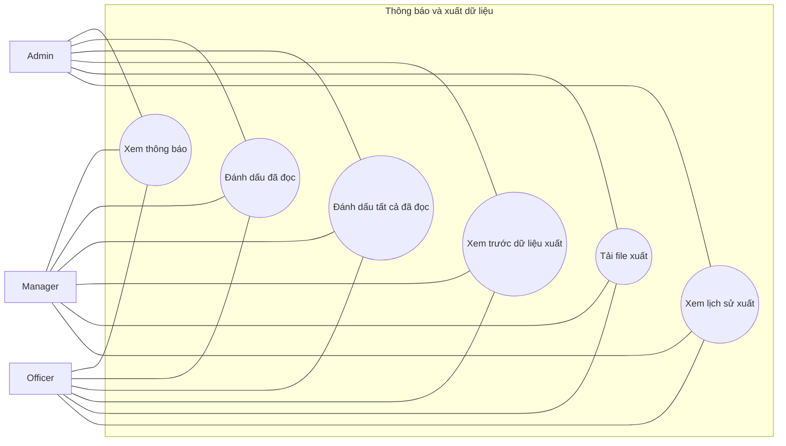

## web9 - Activity quy trình đăng nhập (trải ngang)
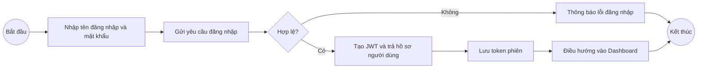

## web10 - Activity quy trình quản lý cán bộ (trải ngang)
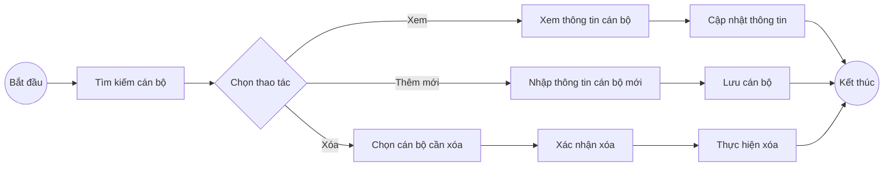

## web11 - Activity quy trình lịch công tác (trải ngang)
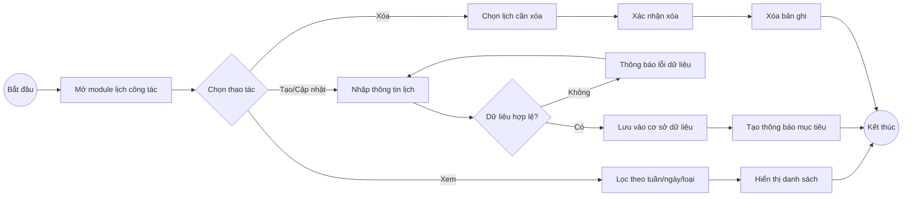

## web12 - Activity quy trình ý kiến trực ban (trải ngang)
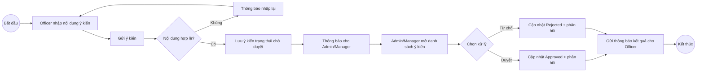

## web13 - Activity quy trình xuất dữ liệu (trải ngang)
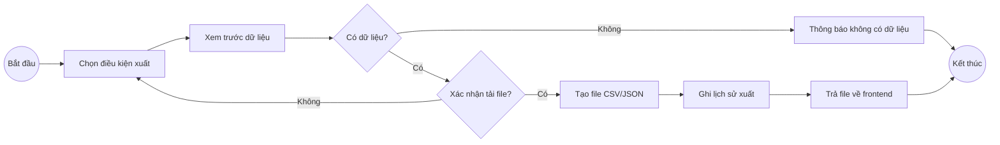

## web14 - Biểu đồ kiến trúc tổng thể
```mermaid
flowchart LR
    U[Người dùng] --> FE[Frontend React + Vite]
    FE --> API[Backend API Node.js + Express]
    API --> DB[(MySQL/MariaDB)]

    FE --> LS[(LocalStorage Token)]
    API --> NTF[Notification Targeting\n(targetUserId / targetRole)]
    API --> LOG[(activity_logs / export_logs)]
```

## web15 - Biểu đồ thành phần frontend
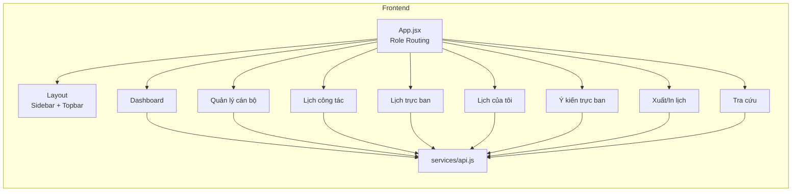

## web16 - Biểu đồ thành phần backend
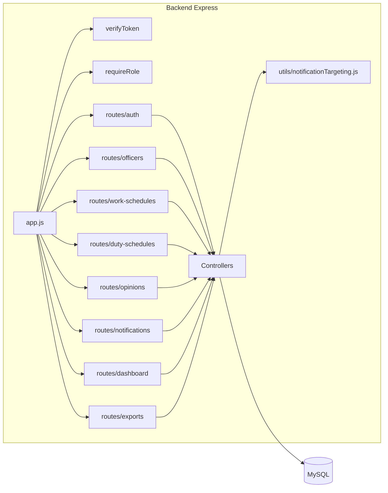

## web17 - Sequence use case đăng nhập
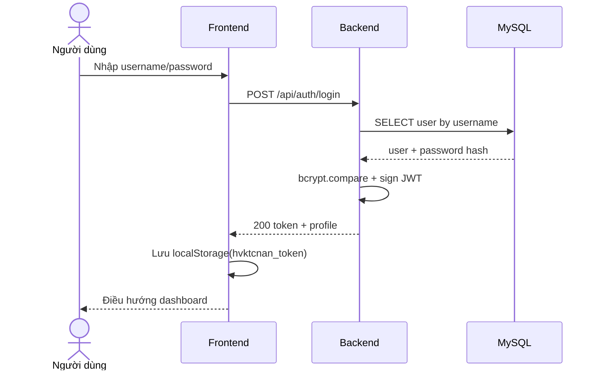

## web18 - Sequence use case tạo lịch công tác
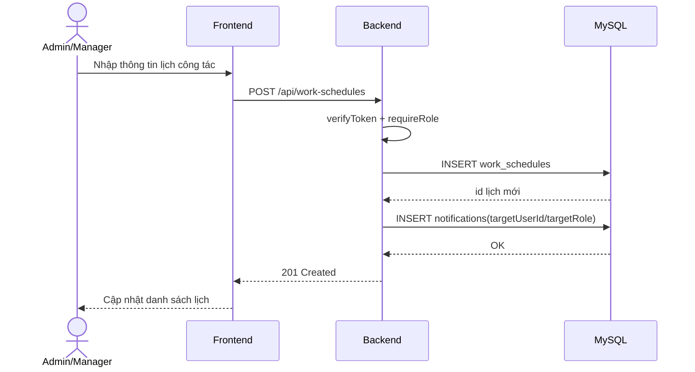

## web19 - Sequence use case ý kiến trực ban
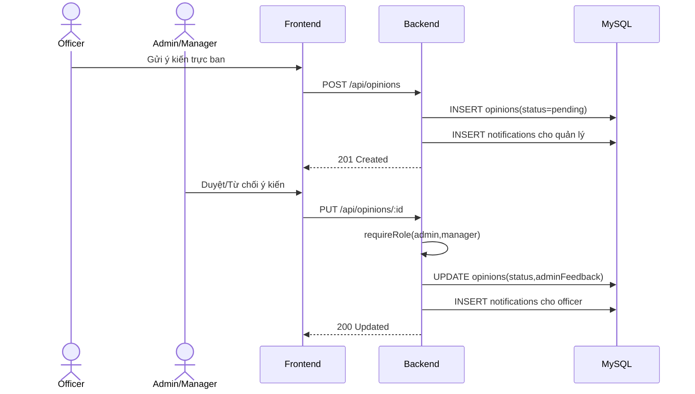

## web20 - Sequence use case xuất dữ liệu
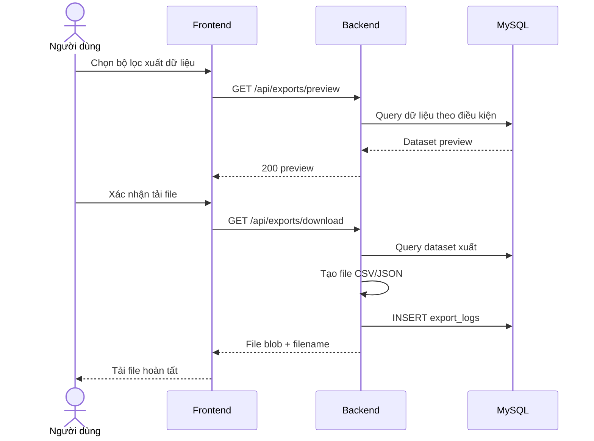

## web21 - ERD hệ thống
```mermaid
erDiagram
    USERS ||--o{ OFFICERS : has_profile
    USERS ||--o{ WORK_SCHEDULES : creates
    USERS ||--o{ DUTY_SCHEDULES : creates
    USERS ||--o{ OPINIONS : reviews
    USERS ||--o{ NOTIFICATIONS : creates
    USERS ||--o{ NOTIFICATION_READS : reads
    USERS ||--o{ ACTIVITY_LOGS : writes
    USERS ||--o{ EXPORT_LOGS : exports

    OFFICERS ||--o{ DUTY_SCHEDULES : assigned_to
    OFFICERS ||--o{ OPINIONS : submits
    OFFICERS ||--o{ WORK_SCHEDULES : responsible_for

    DUTY_SCHEDULES ||--o{ OPINIONS : receives
    NOTIFICATIONS ||--o{ NOTIFICATION_READS : tracked_by

    USERS {
      int id PK
      string username
      string password
      string full_name
      string email
      string role
      string status
    }

    OFFICERS {
      int id PK
      string officer_code
      string full_name
      string department
      int user_id FK
    }

    WORK_SCHEDULES {
      int id PK
      string title
      date work_date
      int week_no
      int responsible_officer_id FK
      int created_by FK
      string status
    }

    DUTY_SCHEDULES {
      int id PK
      int officer_id FK
      datetime start_time
      datetime end_time
      int week_no
      int created_by FK
      string status
    }

    OPINIONS {
      int id PK
      int duty_schedule_id FK
      int officer_id FK
      string status
      text content
      int reviewed_by FK
    }

    NOTIFICATIONS {
      int id PK
      string title
      text message
      int target_user_id FK
      string target_role
      int created_by FK
    }

    NOTIFICATION_READS {
      int id PK
      int notification_id FK
      int user_id FK
      datetime read_at
    }

    ACTIVITY_LOGS {
      int id PK
      int user_id FK
      string action
      string module
      datetime created_at
    }

    EXPORT_LOGS {
      int id PK
      int user_id FK
      string export_type
      string format
      datetime created_at
    }
```
